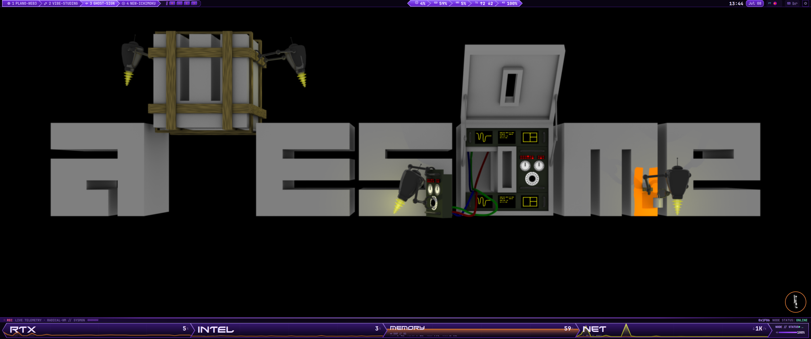
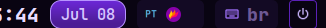
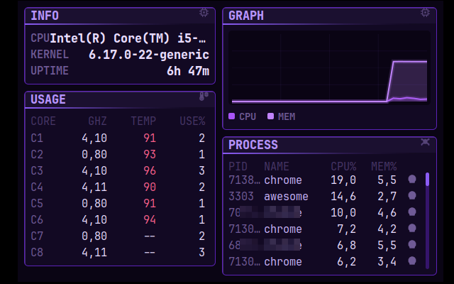
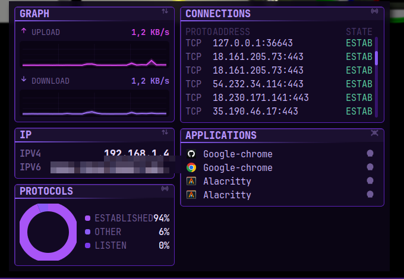
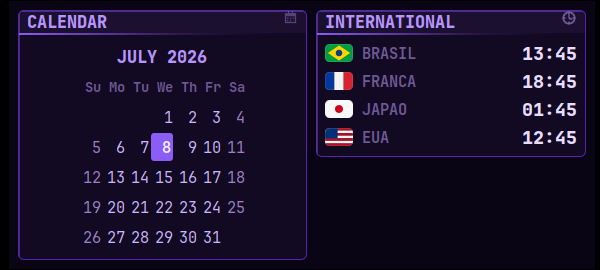
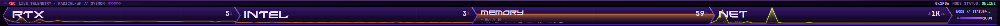
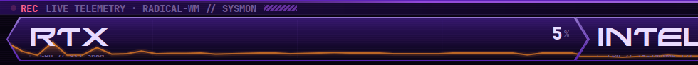
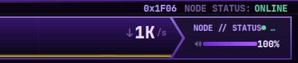
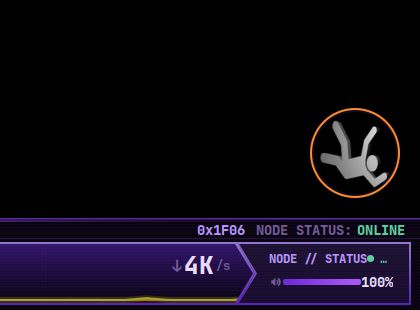

<div align="center">

# ⟨ RADICAL-WM ⟩

### TRACTADO DE MECHANICA CELESTE APPLICADA ÀS ÁREAS DE TRABALHO
#### ou, da composição de um HUD violeta sobre o gerenciador de janellas AwesomeWM

<br>


<br>

*Da lavra do **Doutor Braga Us**, Professor de Sciências Mathemáticas e Geómetra desta Casa,*
*que no Anno da Graça de MDCCCXCVIII entreviu, n'um sonho de éther e phosphorescência,*
*uma machina de janellas banhada em luz violeta — e a lavrou em Lua 5.3.*

<br>



*ESTAMPA I — Vista integral do écran primário (3440×1440), colhida ao vivo por chapa photographica.*

</div>

---

> **ADVERTÊNCIA PRELIMINAR.** Tudo quanto abaixo se estampa não é maquette nem
> pintura: são **chapas photographicas colhidas da machina em pleno funccionamento**,
> com telemetria verdadeira a correr-lhe nas veias. O endereço IPv6 público foi
> velado por decoro — não convém ao geómetra publicar as coordenadas da própria casa.

---

## § I. PROÊMIO — do que este manuscripto trata

Seja dado um écran. **RADICAL-WM** é a minha configuração pessoal do
**AwesomeWM** (Lua 5.3), inteira lavrada à mão: um *cockpit* em **espectro
monochromático violeta** — o que os jovens do porvir hão-de chamar *cyberpunk*,
e que eu, por rigor, chamo **geometria applicada com bom gosto**.

Demonstra-se, no correr destas páginas, que um gerenciador de janellas pode ser
ao mesmo tempo:

- **um observatório** — barras de telemetria perenne (processador, memória,
  machina de calcular geométrica RTX, telegrapho-sem-fio) com gráphicos de área,
  chevrons *powerline* interligados e fita de registro contínuo;
- **um gabinete de instrumentos** — *dashboards* ao-clique com painéis de
  processos, conexões TCP, protocolos em rosca (*donut*), calendário e relógios
  do mundo;
- **um systema de composição** — código arrumado por **Atomic Design**:
  moléculas (widgets-fôlha), organismos (painéis, docas, menus), e um só ponto
  de reunião por écran.

Não ha *framework* alheio, não ha kit emprestado: cada pixel foi posto onde
está por decisão deliberada deste auctor. **Q.E.D.**

---

## § II. DAS ESTAMPAS — inventário photographico dos instrumentos

### II.a — Da Barra Superior, a coroa do écran

Uma só *wibar* rasa corre o topo: as *tags* nomeadas em chevron, os controlos de
tag, os **lozangos de estado** (clique n'um lozango e o respectivo *dashboard*
se manifesta), e ao extremo a data, o teclado e o botão do poder.

<div align="center">


*ESTAMPA II — Secção esquerda: as quatro tags (`PLANO-WEB3`, `VIBE-STUDING`, `GHOST-SIGN`, `NEW-ICHIMOKU`) em chevrons powerline, seguidas dos controlos de tag.*


*ESTAMPA III — Os cinco lozangos de estado: processador, memória, GPU, tráfego do telegrapho e volume. Cada qual é botão: toque, e um dashboard acode.*



*ESTAMPA IV — O extremo direito: hora, data em pílula, idioma, bandeja e o botão do poder.*

</div>

### II.b — Dos Dashboards ao-clique, gabinetes que se manifestam

Postulado do toggle: tocar n'um lozango abre o gabinete do respectivo grupo;
tocar de novo, e elle se recolhe. **Sómente um aberto de cada vez** — e os
painéis occultos *não sondam o systema* (economia de vellas: zero custo quando
fechados).

<div align="center">



*ESTAMPA V — O gabinete **SYSTEM**: identidade da machina (kernel, uptime), tabella de núcleos (GHz, temperatura, uso), gráphico CPU/MEM e o rol dos processos mais vorazes.*



*ESTAMPA VI — O gabinete **NETWORK**: subida e descida do telegrapho, endereços (o IPv6 velado por decoro, como se advertiu), a rosca dos protocolos, as conexões TCP estabelecidas e as applicações que as detêm.*



*ESTAMPA VII — O gabinete **TIME**: o calendário do mez corrente e os quatro relógios do mundo — Brasil, França, Japão e Estados Unidos — para que o geómetra jámais perca um pregão em Tóquio.*

</div>

### II.c — Da MonitorBar, doca de telemetria perenne

Ao rodapé do écran primário instala-se a fita de registro: uma tira rasa
(`REC · LIVE TELEMETRY · RADICAL-WM // SYSMON`) por cima de uma fileira de
**módulos-chevron interligados** — cada qual com gráphico de área ao fundo,
rótulo em typo `Xirod`, leitura grande e quatro células de rodapé. A amostragem
é **sempre assynchrona** (jámais `io.popen`, que enregela o gerente de
janellas — deadlock já conhecido e exorcizado neste repositório).

<div align="center">



*ESTAMPA VIII — A fita integral: RTX ⟩ INTEL ⟩ MEMORY ⟩ NET, e ao cabo o MonRail que fecha a composição.*



*ESTAMPA IX — Detalhe do primeiro módulo: a machina de calcular geométrica (RTX) com sua linha de telemetria alaranjada a serpentear.*



*ESTAMPA X — O MonRail, cauda da fita: `0x1F06 · NODE STATUS: ONLINE`, débito da rede e volume.*

</div>

### II.d — Do Lançador, o botão que respira

Ao canto inferior-direito vive um botão circular animado (um GIF a girar em
moldura incandescente `#ff7a18`). Toque nelle — ou invoque `Super + r` — e um
arco de programmas se despliega, com **busca ancorada ao hub** (`BUSCAR:`) para
achar qualquer applicação pelo nome.

<div align="center">



*ESTAMPA XI — O lançador em repouso, montando guarda ao canto do écran.*

</div>

---

## § III. DA ANATOMIA — Atomic Design, ou cada cousa em seu logar

A architectura obedece ao methodo atómico, de baixo para cima:

```
rc.lua                     — o ponto de entrada (ordem de require LOAD-BEARING)
├── src/theme/             — tokens da paleta violeta, metrics, user_variables
├── src/core/              — cola de arranque: error handling, rules, signals, notificações
├── src/molecules/         — widgets-fôlha, um ofício cada: audio, battery, clock,
│                            cpu_info, gpu_info, network, plano_gif, world_clock…
├── src/organisms/         — painéis, docas, menus, OSDs: control_center, monitor_bar,
│                            app_launcher, info/usage/process/net_graph/connections/
│                            protocols/ip/apps/calendar panels, powermenu, titlebar…
├── src/tools/  src/scripts/  src/assets/
├── mappings/              — teclado e rato (global_keys, client_keys, bind_to_tags…)
├── radical_wm/init.lua    — o THEÓREMA CENTRAL: composição por cada écran
└── icons/                 — o conjunto de 41 ícones SVG do HUD violeta
```

**Theórema central** (`radical_wm/init.lua`): todo écran recebe as suas quatro
tags; *sómente o écran primário* recebe a composição integral — barra superior,
dashboards, lançador e MonitorBar. Os demais écrans permanecem limpos, como
convém a um quadro-negro auxiliar. **Q.E.D.**

A ordem de `require` no `rc.lua` é **portante** (load-bearing): o GIF do
lançador pré-carrega-se *antes* do tema; `user_vars`, `Theme` e `Hover_signal`
são globaes de que muitos módulos posteriores dependem. Não se localizem sem
se emendar cada consumidor.

---

## § IV. DA VERIFICAÇÃO — como se prova que a machina anda

```sh
# Prova de syntaxe e de carga (da raiz do repositório):
awesome -k rc.lua
```

- A prova acima acusa erros de sintaxe e de carga, **mas não** binários de
  desktop ausentes, erros de widget em runtime, nem regressões visuaes.
- Recarregar a configuração viva exige **reiniciar o AwesomeWM**:
  `Super + Ctrl + r`. Não ha hot-reload para edições arbitrárias — a machina
  a vapor não se remenda em movimento.

---

## § V. DOS REQUISITOS — as peças que a machina reclama

| Peça | Ofício |
|---|---|
| **AwesomeWM** + **Lua 5.3** | o gerenciador e a sua língua |
| `alacritty` | o terminal (mutável em `user_vars.terminal`) |
| `picom` | o compositor (config esperada em `~/.config/picom.conf`) |
| `rofi` | menus auxiliares |
| `pactl` / `playerctl` | volume e música |
| `iw`, `ping` | o telegrapho-sem-fio e a sua sondagem |
| ImageMagick (`convert`) | lapidação de imagens |
| `nvidia-smi` *(opcional)* | telemetria da RTX; ausente, degrada com graça para `--` |
| fonte **Xirod** *(opcional)* | os rótulos de marca da MonitorBar |

---

## § VI. DO MANEJO — teclas que governam o apparelho

| Tecla | Effeito |
|---|---|
| `Super + s` | a fôlha de auxílio (cheat sheet de todas as teclas) |
| `Super + Enter` | invoca o terminal |
| `Super + r` | abre/fecha o lançador com busca |
| `Super + Ctrl + r` | reinicia o AwesomeWM |
| `Super + ←/→` | navega entre tags |
| clique n'um lozango | manifesta o dashboard do grupo (SYSTEM / NETWORK / TIME) |
| teclas de volume/brilho | OSDs violeta acodem ao chamado |

---

## § VII. DAS VARIÁVEIS DO UTENTE — o Livro das Preferências

Toda preferência pessoal — modkey, fontes, terminal, papel de parede,
autostart, programmas da doca, interfaces de rede, transparência, layouts —
mora n'um só manuscripto: **`src/theme/user_variables.lua`**. Se a mudança é
"gosto do utente", é lá que ella pertence, e não no código dos widgets.

---

## § VIII. DOS MANUSCRIPTOS AUXILIARES

Os tratados de apoio do auctor (notas de architectura, o compêndio do systema
de design e a pasta `especificacoes_tecnicas/` com o toolkit) são **locaes e
não versionados** — acompanham a machina do geómetra, não o repositório
público. O que o leitor precisa para ler e correr este código está inteiro
neste README.

---

<div align="center">

*Lavrado com pena de aço e luz violeta, no Anno da Graça de*
**MDCCCXCVIII**
*(que os calendários da machina teimam em grafar 2026),*

*pelo insigne geómetra*

**⟨ DOUTOR BRAGA US ⟩** ✒

*Professor de Sciências Mathemáticas · Geómetra desta Casa · `0x1F06 NODE: ONLINE`*

**Q.E.D.**

</div>
